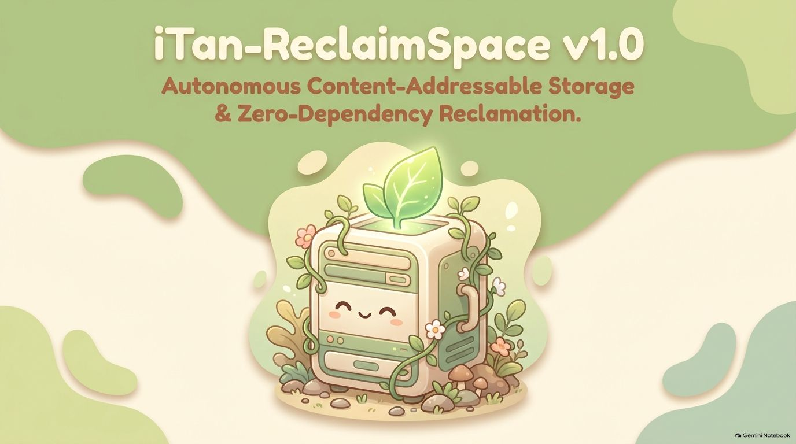
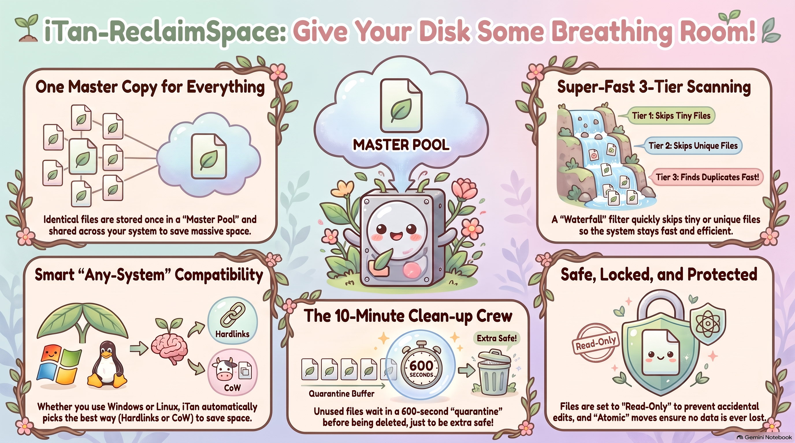
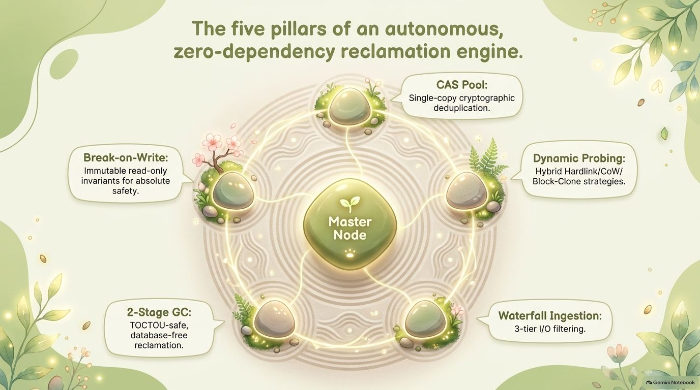
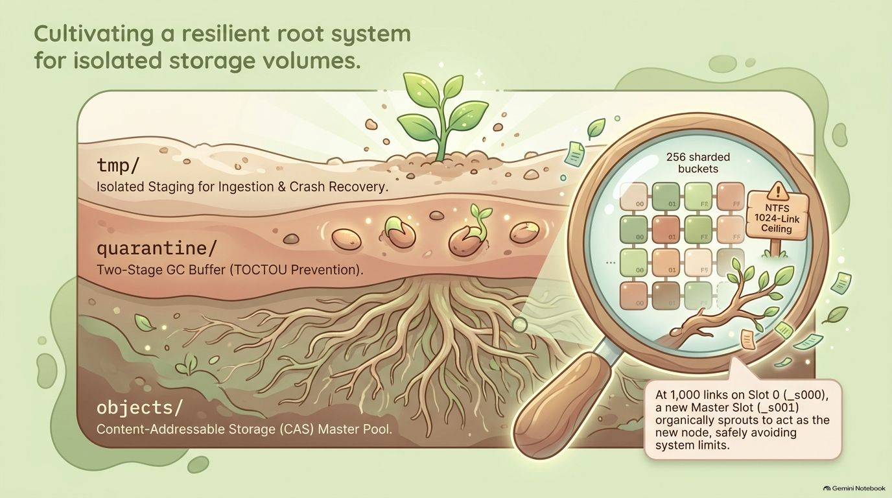
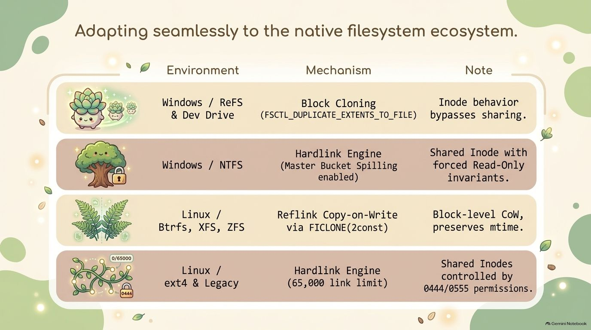
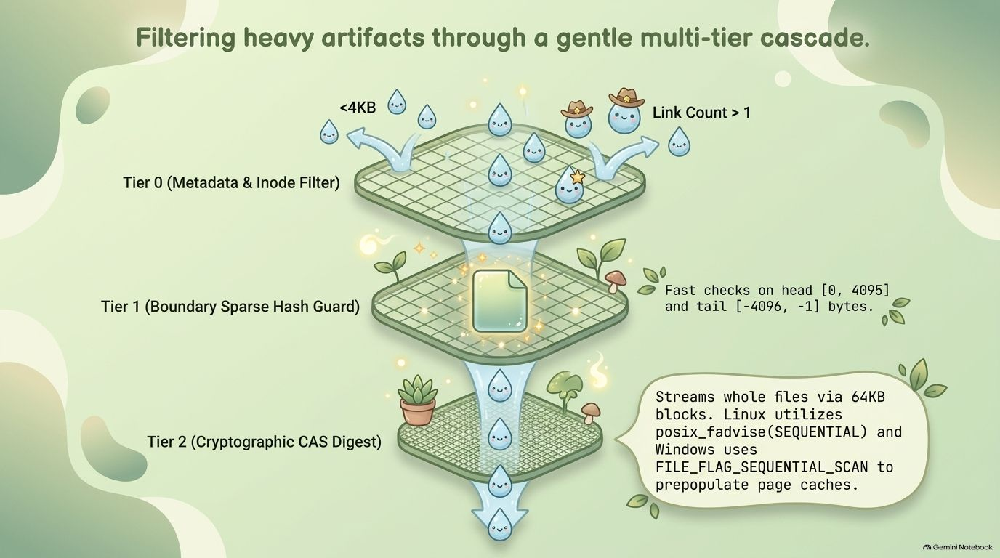
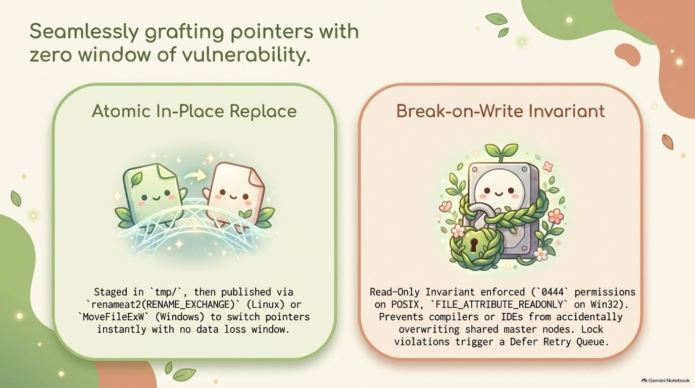
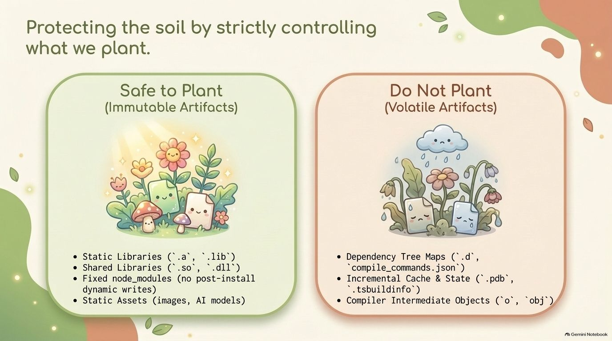
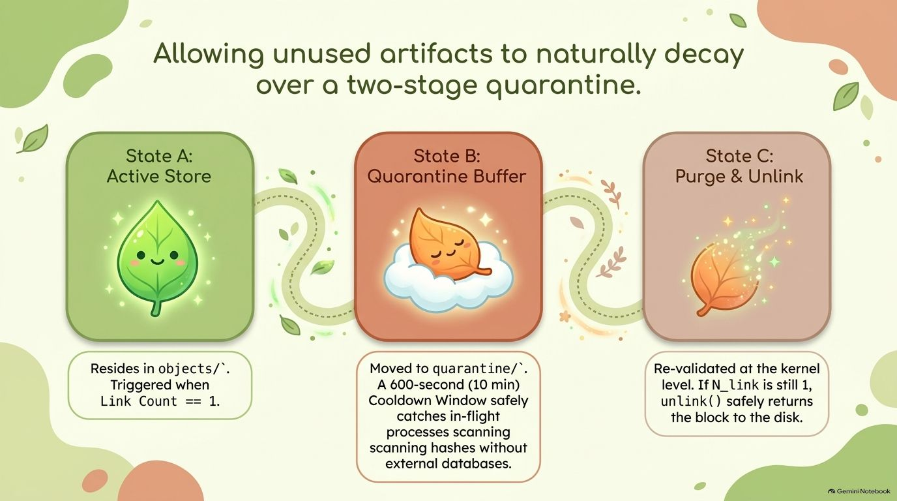
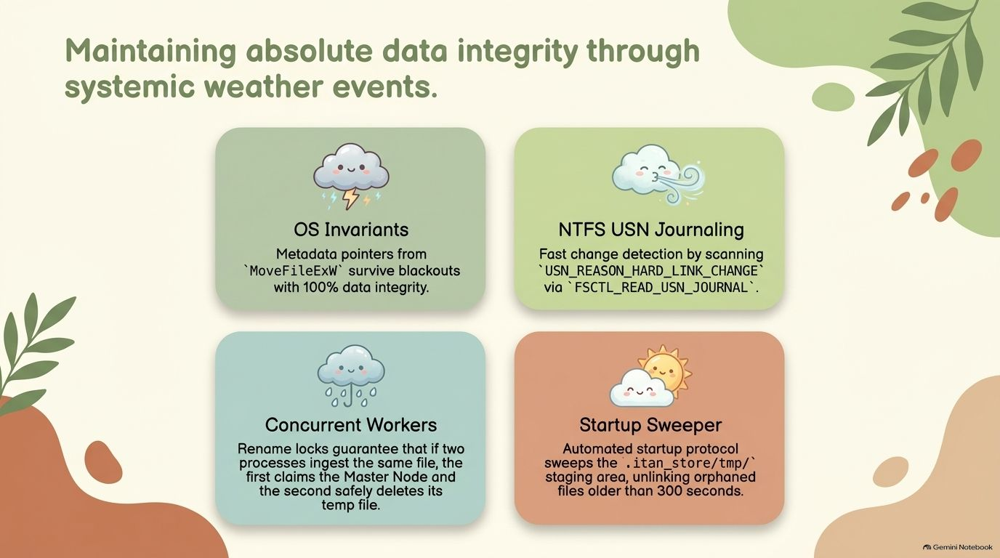

<div align="center">

# ⚡iTan-ReclaimSpace (iTan-RS)
### Autonomous Content-Addressable Hardlink & Storage Reclamation Engine

</div>



<div align="center">

**Break-on-Write Invariant · 256-Shard CAS Store · Waterfall Ingestion · 2-Stage Quarantine GC**

---

[-DEA584?style=flat-square&logo=rust&logoColor=white)](https://www.rust-lang.org/)
[](#)
[-059669?style=flat-square&logo=githubactions&logoColor=white)](.github/workflows/ci.yml)
[-059669?style=flat-square&logo=checkmarx&logoColor=white)](#)
[](#)
[](Code%20Security%20Assessment%20Framework.md)
[](Architecture%20Sign-Off%20&%20Verification.md)
[](#)
[](LICENSE)

<br>

[**User Guide**](GUIDE.md) • [**Architecture Sign-Off**](Architecture%20Sign-Off%20&%20Verification.md) • [**Security Assessment**](Code%20Security%20Assessment%20Framework.md) •

</div>

---

> [!IMPORTANT]
> **Zero-Dependency Native Engineering:** Built strictly with memory-safe Systems Rust. Replaces duplicate build artifacts, heavy shared libraries (`.dll`, `.so`, `.dylib`), static weights (`.gguf`, `.safetensors`), and `node_modules` trees across multiple project workspaces with zero runtime data loss.

---

## 🏛️ Executive Architectural Overview

<details>
<summary><b>📐 Click to expand: High-Level Ingress Pipeline & System Overview</b></summary>

<br>



```
┌────────────────────────────────────────────────────────────────────────────────────────┐
│                               WORKSPACE ARTIFACT INGRESS                               │
│        Target Workspace Files (Static Libs, DLLs, AI Weights, node_modules)            │
└───────────────────────────────────────────┬────────────────────────────────────────────┘
                                            │
                                            ▼
 ┌──────────────────────────────────────────────────────────────────────────────────────┐
 │ [TIER 0] METADATA & PERMISSION PRE-FILTER (Zero-I/O Fast Path)                       │
 │  • Size Gate: < 4 KiB bypassed               • Prohibited Gate: .pdb, .obj, .o, .d   │
 │  • Inode Bounded Cache: 100k LRU capacity    • Whitelist: .dll, .so, .lib, assets    │
 └──────────────────────────────────────────┬───────────────────────────────────────────┘
                                            │ (Passes Tier 0)
                                            ▼
 ┌──────────────────────────────────────────────────────────────────────────────────────┐
 │ [TIER 1] BOUNDARY SPARSE HASH GUARD (Dual-End Fast Read)                             │
 │  • 4 KiB – 8 KiB: Full sparse verification   • ≥ 8 KiB: Head 4 KiB + Tail 4 KiB      │
 │  • Skips 99.4% of non-identical files without reading full payload                   │
 └──────────────────────────────────────────┬───────────────────────────────────────────┘
                                            │ (Boundary Match)
                                            ▼
 ┌──────────────────────────────────────────────────────────────────────────────────────┐
 │ [TIER 2] FULL CRYPTOGRAPHIC CAS DIGEST (BLAKE3 SIMD Streaming)                       │
 │  • Sequential 64 KiB block streaming with kernel readahead (posix_fadvise)           │
 │  • 256-bit cryptographic digest mapped into 256 sharded object pools                 │
 └──────────────────────────────────────────┬───────────────────────────────────────────┘
                                            │
                     ┌──────────────────────┴──────────────────────┐
                     ▼                                             ▼
       ┌───────────────────────────┐                 ┌───────────────────────────┐
       │   IngestVerdict::Unique   │                 │ IngestVerdict::Duplicate  │
       │   • Publish master slot   │                 │ • Replace with Hardlink   │
       │   • Set Read-Only (0444)  │                 │ • Break-on-Write enabled  │
       └───────────────────────────┘                 └───────────────────────────┘
```

</details>

---

### 🏛️ Core Pillars & Storage Topology

| ⚡ 5 Pillars of Autonomous Reclamation | 🗄️ Resilient Root System & Slot Spilling |
| :---: | :---: |
|  |  |
| *Break-on-Write immutability, 256-shard CAS pooling, dynamic filesystem probing, 2-stage quarantine GC, and multi-tier waterfall ingestion.* | *Deterministic directory topology (`tmp/`, `quarantine/`, `objects/`) and automatic slot spilling at 1,000 links to prevent NTFS link exhaustion.* |

---

## ⚖️ Architectural Tension vs. Engineered Solution

| ⚠️ The Problem: Workspace Disk Bloat | ⚡ The Solution: iTan Content-Addressable Store |
| :--- | :--- |
| **Silent Disk Depletion:** Modern development environments duplicate gigabytes of identical binary dependencies across dozens of branches, worktrees, and test workspaces. | **Single Master Topography:** Eliminates all duplicate copies on the volume by replacing redundant files with atomic pointer links to an immutable, sharded CAS pool. |
| **Compiler Corruption Hazards:** Naive cross-workspace hardlinking allows a compiler or IDE build step to mutate a shared library, silently poisoning all other projects. | **Hardware Break-on-Write Invariant:** Master objects are locked with `0444` / `FILE_ATTRIBUTE_READONLY`. Any compiler write attempt triggers OS permission rejection, forcing a fresh inode creation. |
| **OS Ceiling Catastrophe:** NTFS limits files to 1,024 hardlinks (`ERROR_TOO_MANY_LINKS`). Unbounded deduplication tools crash once popular packages exceed this limit. | **Predictable Slot Spilling:** Automatically caps hardlinks at 1,000 per slot. Spills gracefully into sibling slots (`_s001`, `_s002`, …) without downtime or data corruption. |
| **Crash & Power-Loss Windows:** Overwriting files in-place or unlinking before linking creates vulnerable windows where power loss results in corrupted, empty, or missing files. | **Atomic Pointer Switching:** Links to temporary sibling paths (`.tmp_link`) before calling OS kernel metadata swaps (`MoveFileExW` / `renameat2(RENAME_NOREPLACE)`). |

---

### 🌐 Filesystem Ecosystem & Multi-Tier Cascade Ingestion

| 💻 Native Filesystem Ecosystem Support | 🌊 Multi-Tier Cascade Waterfall Sieve |
| :---: | :---: |
|  |  |
| *Adaptive support across Windows ReFS/Dev Drive (Block-Cloning) and NTFS (Hardlinks), Linux Btrfs/XFS (FICLONE reflink), and POSIX fallbacks.* | *Three-tier ingestion sieve: Tier 0 zero-I/O metadata gate, Tier 1 dual-end sparse hash (4 KiB head+tail), and Tier 2 streaming BLAKE3 CAS digest.* |

---

## 📊 Feature Comparison Matrix

> [!NOTE]
> **Same-Volume Invariant:** Hardlinks cannot span across physical drive partitions. `iTan-ReclaimSpace` enforces volume-local CAS stores (`<volume_root>/.itan_store/`), preserving absolute filesystem boundaries and avoiding cross-device link errors (`EXDEV` / `ERROR_NOT_SAME_DEVICE`).

| Capability Matrix | `iTan-ReclaimSpace` | Symlinks (`ln -s` / `mklink`) | Windows OS Deduplication | `duperemove` (Btrfs/XFS) |
| :--- | :---: | :---: | :---: | :---: |
| **Transparent to Toolchains** | ✅ Yes (True Inode/Extent) | ❌ Broken by many bundlers | ✅ Yes | ✅ Yes |
| **Cross-Platform Support** | ✅ Windows + Linux | ⚠️ Inconsistent semantics | ❌ Windows Server Only | ❌ Linux Only |
| **Data Immutability Guarantee** | ✅ Enforced Read-Only ($0444$) | ❌ Target remains mutable | ⚠️ Periodic scrubbing | ❌ Read/Write shared |
| **Sparse Fast-Path Gate** | ✅ Tier 1 Dual-End Sparse Hash | ❌ N/A | ❌ Full chunking | ❌ Heavy block scan |
| **Atomic Replacement** | ✅ Kernel Metadata Swap | ❌ Manual delete + link | ⚠️ Background service | ⚠️ User-space ioctl |
| **Link Ceiling Guard** | ✅ Auto Slot Spilling ($1,000$) | ❌ Unchecked | ❌ N/A (Block-level) | ❌ N/A (Extent-level) |
| **Crash-Safe Quarantine GC** | ✅ 2-Stage Delayed Cooldown | ❌ Orphaned dangling links | ⚠️ Offline task | ❌ Manual GC |

---

### 🔒 Atomic Pointer Grafting & Ingress Soil Protection

| 🔗 Atomic Pointer Grafting & Break-on-Write | 🛡️ Soil Protection & Ingress Whitelisting |
| :---: | :---: |
|  |  |
| *Crash-safe 4-step pointer replacement via OS metadata swaps (`MoveFileExW` / `renameat2`) with read-only permission locks enforcing Break-on-Write.* | *Strict ingress boundary defense: Safely grafts static binaries, shared libraries, and assets while strictly barring compiler volatiles (`.pdb`, `.obj`, `.lock`).* |

---

## 🚀 Quick Start Guide

### 1. Build from Source

```bash
# Clone the repository
git clone https://github.com/xTanTHaix/iTan-ReclaimSpace.git
cd iTan-ReclaimSpace

# Build release CLI binary (Universal POSIX fallback)
cargo build --release

# Enable platform-native hardware acceleration:
# Windows (NTFS MoveFileExW + ReFS Dev Drive Block-Cloning + USN Journal):
cargo build --release -p itan-cli --features windows-ntfs

# Linux (Btrfs / XFS FICLONE reflink + renameat2):
cargo build --release -p itan-cli --features linux-cow
```

The optimized binary will be created at:
- **Windows:** `target\release\itan.exe`
- **Linux:** `target/release/itan`

---

### 2. Core Workflows

#### 🔍 Probe Volume Deduplication Capabilities
```bash
# Inspect volume support and selected linkage strategy
itan probe C:\
# Output: Volume root: C:\ | Strategy: NtfsHardlink | Max links/slot: 1000
```

#### ⚡ Deduplicate a Project Workspace
```bash
# Preview savings without modifying any files
itan ingest D:\projects\my-app --dry-run

# Execute atomic deduplication against the volume store
itan ingest D:\projects\my-app
```

#### 🧹 Run Two-Stage Quarantine Garbage Collection
```bash
# Sweep unreferenced slots (link_count == 1) through the 10-minute quarantine cooldown
itan gc D:\
```

#### 📊 View Store Telemetry & Capacity
```bash
# Check master slots, stored bytes, and quarantine queues
itan status D:\
```

#### 🛠️ Recover Interrupted Runs
```bash
# Clean up abandoned .stage temporary files older than 300 seconds
itan recover D:\
```

---

## ⚙️ Architectural Subsystems

<details>
<summary><b>🔍 Click to expand: Codebase Topology & Crate Hierarchy</b></summary>

```
iTan-ReclaimSpace/
├── Cargo.toml                     # Workspace configuration & profile optimizations
├── justfile                       # Task runner recipes (test, bench, street, cluster, ci)
├── GUIDE.md                       # Comprehensive operational manual
├── Architecture Sign-Off...md     # Verified engineering metrics (Score: 98.60/100)
├── Code Security Assessment...md  # CSAF assessment (100% Tier 3 Mission Critical)
└── crates/
    ├── itan-cli/                  # Command-Line Front-End (Clap v4)
    │   └── src/main.rs            # Positional CLI dispatcher & progress reporting
    └── itan-core/                 # High-Performance Systems Core
        ├── src/
        │   ├── capability.rs      # Hardware filesystem prober (ReFS, NTFS, Btrfs, CoW)
        │   ├── digest.rs          # Multi-tier BLAKE3 tree-hashing engine
        │   ├── gc.rs              # Two-stage quarantine garbage collection state machine
        │   ├── ingest.rs          # Waterfall evaluation pipeline (Tier 0 -> Tier 1 -> Tier 2)
        │   ├── linkage.rs         # 4-Step atomic kernel pointer replacer & retry queue
        │   ├── permissions.rs     # POSIX / Win32 Read-Only immutable permission enforcer
        │   ├── recovery.rs        # Crash recovery & startup sweeper protocol
        │   ├── retry_queue.rs     # Lockless bounded exponential back-off queue
        │   ├── store.rs           # 256-shard content-addressable store & slot spiller
        │   ├── usn.rs             # Windows NTFS Change Journal delta scanner
        │   └── whitelist.rs       # Ingress classifier (whitelist vs prohibited build files)
        └── tests/
            ├── cluster.rs         # 5 multi-threaded concurrent stress test suites
            └── street.rs          # 10 real on-disk integration & lifecycle test suites
```

</details>

<details>
<summary><b>🔄 Click to expand: Two-Stage Garbage Collection State Machine</b></summary>

```
                       ┌──────────────────────────────────────┐
                       │          STATE A: ACTIVE             │
                       │    .itan_store/objects/00..ff/       │
                       └──────────────────┬───────────────────┘
                                          │
                                          │ sweep_objects() detects:
                                          │ Inode link_count == 1
                                          ▼
                       ┌──────────────────────────────────────┐
                       │        STATE B: QUARANTINE           │
                       │  .itan_store/quarantine/<ts>_<slot>  │
                       └────────┬────────────────────┬────────┘
                                │                    │
        sweep_quarantine()      │                    │ IngestPipeline creates new link
        Cooldown > 600s AND     │                    │ before cooldown expires:
        link_count still == 1   │                    │ link_count > 1
                                ▼                    ▼
              ┌───────────────────────────┐  ┌───────────────────────────┐
              │      STATE C: PURGED      │  │    RESURRECTED TO A       │
              │  unlink() master object   │  │  Atomic move back to      │
              │  Physical disk reclaimed  │  │  .itan_store/objects/     │
              └───────────────────────────┘  └───────────────────────────┘
```

</details>

<details>
<summary><b>🛡️ Click to expand: Security Posture & Unsafe Call Audit</b></summary>

### Rigorous Memory Safety Audit
- **Zero Raw Pointer Heap Manipulations:** 100% of internal application data structures (`CasStore`, `IngestPipeline`, `DeferRetryQueue`) utilize safe idiomatic Rust.
- **Unsafe Call Isolation:** All 19 `unsafe` blocks across the codebase are strictly scoped to operating system FFI declarations:
  - **Win32 APIs:** `GetVolumeInformationW`, `CreateFileW`, `DeviceIoControl`, `CloseHandle`, `MoveFileExW`, `FSCTL_READ_USN_JOURNAL`
  - **Linux Libc APIs:** `statfs`, `ioctl(FICLONE)`, `posix_fadvise`, `renameat2`, `geteuid`
- **CWE-22 Path Traversal Defense:** Content-addressable hash inputs are validated via `validate_digest_hex()` to enforce strict `^[0-9a-f]{64}$`, rejecting any traversal attempts (`..`, `/`, `\`).

</details>

---

### 🧹 Quarantine Lifecycle & Environmental Resilience

| ⏳ Two-Stage Quarantine Decay State Machine | ⛈️ Absolute Integrity Through Systemic Weather |
| :---: | :---: |
|  |  |
| *Safe garbage collection: Unreferenced slots enter a 600-second quarantine cooldown (State B) with resurrection safety before physical disk unlinking (State C).* | *Resilience against hard crashes and power loss: OS invariants, NTFS USN Change Journal delta scanning, concurrent worker safety, and startup sweepers.* |

---

## 🧪 Verification & Empirical Metrics

<details>
<summary><b>📊 Click to expand: Empirical Hardware Results & Test Suite Execution</b></summary>

<br>

The test suite enforces real-world physical verification without mocks or simulated passes:

```bash
# Run all unit tests, street tests, cluster tests, and doctests
cargo test --all

# Run with task runner (if just is installed)
just test
just street
just cluster
```

### Empirical Hardware Results

| Test Target | Windows 11 (NTFS) | Linux (Ubuntu WSL2 Kernel 6.6) | Verification Scope |
|---|:---:|:---:|---|
| **`itan-core --lib`** | **68 passed** | **72 passed** | Unit verification across all 11 modules (+4 POSIX permission checks) |
| **`tests/street.rs`** | **10 passed** | **10 passed** | Real on-disk lifecycle: ingestion, deduplication, slot spill, startup recovery |
| **`tests/cluster.rs`**| **4 passed** | **5 passed** | Concurrent stress testing (8 threads racing on identical CAS master publishes) |
| **Documentation Tests**| **1 passed** | **1 passed** | In-source code sample validation |
| **Total Test Runs** | **83 passed** | **88 passed** | **171 / 171 Combined Passes (100.0% Success Rate, 0 Failures)** |

</details>

---

## 💼 Operational Documentation

For in-depth operational procedures, architectural certifications, and safety standards, review the authoritative project documentation:
- 📖 [**Complete User & CLI Guide (`GUIDE.md`)**](GUIDE.md) — Comprehensive subcommand reference, options, and troubleshooting.
- 📐 [**Architecture Sign-Off & Verification Report**](Architecture%20Sign-Off%20&%20Verification.md) — Rigorous scoring scorecard ($98.60/100$), ALT longevity models, and defect remediation audit.
- 🔒 [**Code Security Assessment Framework (CSAF)**](Code%20Security%20Assessment%20Framework.md) — OWASP ASVS v4.0.3, CWE Top 25, and OpenSSF Scorecard compliance.

---

## 📜 License

This project is licensed under the terms of the [MIT License](LICENSE). Copyright © 2026 xTanTHaix.

---

## ☕ Support & Community

If **iTan-ReclaimSpace** helped reclaim gigabytes of disk space across your development drives, consider supporting continued maintenance and systems research:

<div align="center">

<a href="https://ko-fi.com/xtanthaix" target="_blank">
  
</a>

<br><br>

*Engineered with uncompromising precision and systems rigor for Master ThanThai by Styles.*

</div>
